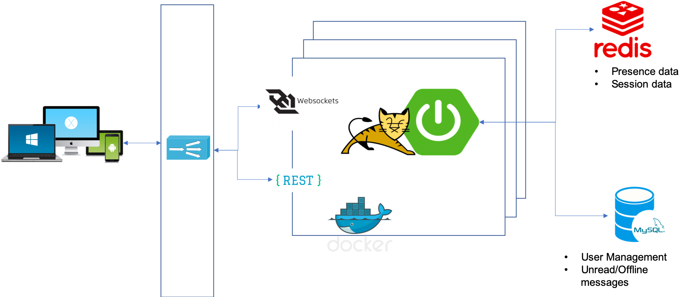

A Spring Boot based Chat application.
==========

This application demonstrates one-one user chat using Spring Boot. It implements a scalable architecture and will be packaged as docker containers.
The client and server use websocket for messaging, and the application implements the sticky sessions.

Getting Started
--------

Download [Docker Desktop](https://www.docker.com/products/docker-desktop) for Mac. [Docker Compose](https://docs.docker.com/compose) will be automatically installed. On Linux, make sure you have the latest version of [Compose](https://docs.docker.com/compose/install/).

Run the application
-------

You can build from source using:

```
docker-compose -f docker-compose.yml build
```

Then run the app using:

```
docker-compose -f docker-compose.yml up -d
```


Architecture
---------

  

Note
----
The application implements only one to one text message chat. This can be enhanced to support group chat and media.

